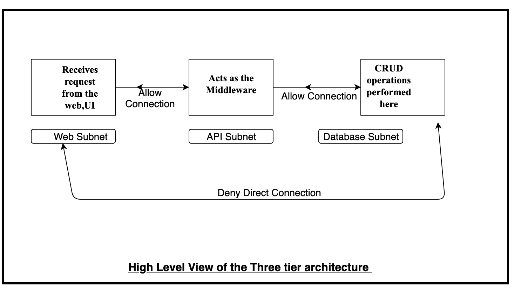

# Deploying the three tier architecture using Terraform


Terraform is a tool for building, changing, and versioning infrastructure safely and efficiently. Terraform can manage existing and popular service providers as well as custom in-house solutions.<br/>

Configuration files describe to Terraform the components needed to run a single application or your entire datacenter. Terraform generates an execution plan describing what it will do to reach the desired state, and then executes it to build the described infrastructure. As the configuration changes, Terraform is able to determine what changed and create incremental execution plans which can be applied.<br/>

The infrastructure Terraform can manage includes low-level components such as compute instances, storage, and networking, as well as high-level components such as DNS entries, SaaS features, etc.<br/>
## THREE TIER ARCHITECTURE
The three   architecture  is a basic model for developing a web database application and communication is done using this 3-level application logic.
The  database tier is  where data gets stored in a database server and is known as fully secure . Various CRUD operations are being performed here. Next is the Api layer inside the Api subnet which provides a communication between the web server and the data base server. Finally there is a web server which aacepts all the internet requests and send requests to the api server.
<p align="center">
</br>
Figure 1.1: High Level View of the Architecture 
</br></br>

Figure 1.2: Detailed Architecture in Azure

</p>


In this  script  two virtual networks are created  with three subnets each and having three network security groups associated with the subnets.Also  Peering is enabled betwwen the two virtual networks.<br/>

Note: Incase of Disaster Recovery we are modifying the database NSG so that the database subnet of virtual network 1 can send its replica to database subnet of virtual network 2 through a specific port.
###  Detail of the Architecture implemented
<p allign="center">

Figure 1.3 High Level View of the Architecture </br>
</p>

### Method  to deploy  the Terraform file
Configure Terraform [`configuring Terraform`](https://docs.microsoft.com/en-us/azure/virtual-machines/linux/terraform-install-configure) if you are using Azure CLI on your local machine.

<br />
<a href="https://shell.azure.com" target="_blank">

</a>
</br>

```bash 
terraform init
terraform plan
terraform apply
```
